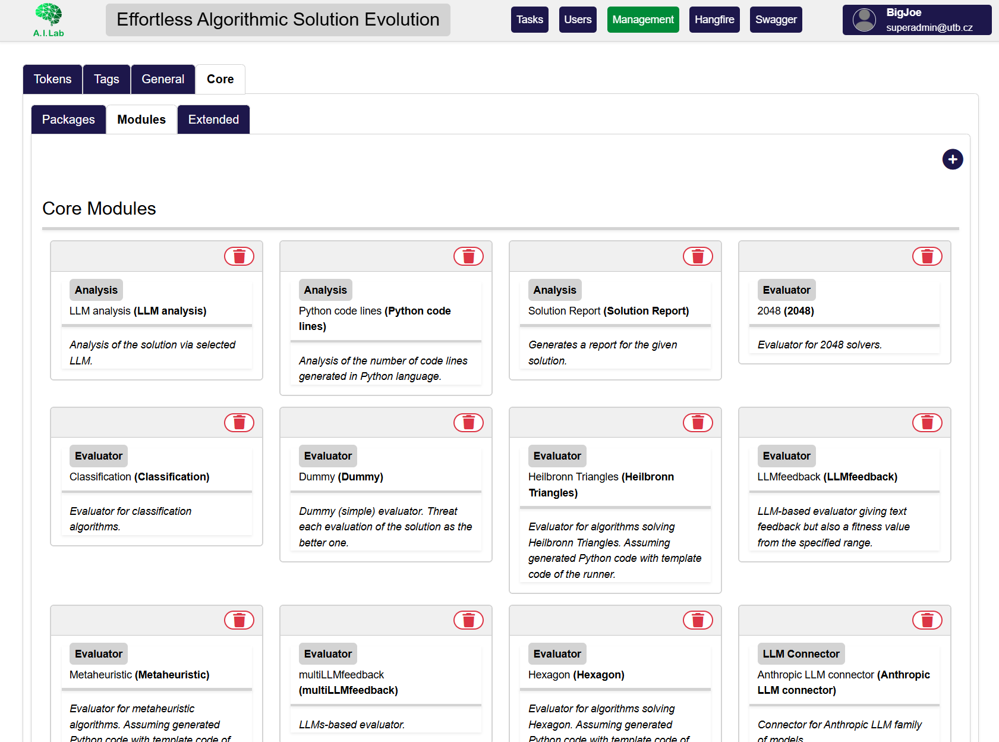

# Tasks, modules, and iterations

FrontEASE is the control surface for EASE. A **task** is a complete, reproducible experiment definition: its prompts, selected modules, module parameters, access rules, and the results produced during execution.

## The iterative loop

Most tasks follow the same loop:

```text
System and initial messages
          ↓
LLM connector generates a candidate
          ↓
Solution module stores the candidate
          ↓
Tests and evaluator score it and produce feedback
          ↓
Repeated message asks for an improved candidate
          ↓
Stopping conditions decide whether to continue
          ↓
Analysis and statistic modules process the run
```

The exact behavior comes from the selected modules. For example, one task may evolve source code against unit tests, while another improves text using an LLM-based evaluator.

## Task configuration

Every task has these general settings:

| Setting | Purpose |
| --- | --- |
| Name | Identifies the task in the task grid and downloads. |
| Optimization goal | Tells EASE whether higher or lower fitness values are better. |
| Tags | User-defined labels for organization and filtering. |
| System message | Establishes the generator's role and durable instructions. |
| Initial message | Defines the first assignment sent to the generator. |
| Repeated message | Defines the instruction used for later improvement iterations. |
| Maximum context size | Limits how many earlier generator/user pairs are retained. A value shown as infinity keeps the full available context. |
| Feedback from solution | Includes evaluator feedback when composing the next iteration. |

Changing a field that affects available module options can briefly place the editor in a loading state while FrontEASE asks the core service to recalculate compatible choices.

## Module categories

Three module categories select one primary module each:

| Category | Responsibility |
| --- | --- |
| Solution | Defines the candidate representation, such as text or a task-specific structure. |
| LLM connector | Connects to a model provider and generates candidate solutions. |
| Evaluator | Produces fitness values and, where supported, feedback. |

Four categories may contain multiple modules:

| Category | Responsibility |
| --- | --- |
| Tests | Execute checks or benchmarks against a candidate. |
| Stopping conditions | End the run when an iteration, fitness, time, or other criterion is met. |
| Analyses | Produce post-processing or task-specific analysis outputs. |
| Statistics | Collect metrics about the run. |

Available choices are discovered from the running EASE core. Each module supplies its own parameter form, so the controls shown after selecting a module vary by package. Parameters can include text, numbers, flags, lists, time values, model choices, and saved-token selectors.



/// caption
Module selection and package-defined parameters in the task editor.
///

## Messages, solutions, and fitness

During a run, the task builds an ordered message history:

- **System messages** establish behavior.
- **User messages** contain the initial assignment and later improvement requests.
- **AI messages** contain generated candidates and identify the model used.

A solution is associated with the AI message that produced it. It can have a fitness value, evaluator feedback, metadata, and downloadable files. Selecting a solution in the overview highlights its corresponding message, which makes it easier to connect an evaluation result with the generated content.

## Access and ownership

The task author owns the task. During task editing, the author or an Owner can grant access to individual users or organizations. Administrative roles can see more of the system, but task actions still depend on the task's state and the access checks enforced by the server.

See [Roles, states, and actions](../reference/roles-states-actions.md) for the exact state-dependent controls.

## A practical configuration order

For a new task, configure the fields in this order:

1. Give the task a distinctive name and choose the optimization goal.
2. Write the system and initial messages.
3. Select the solution type.
4. Select and configure the LLM connector.
5. Select and configure the evaluator.
6. Add tests and at least one stopping condition appropriate for the experiment.
7. Add analyses or statistics if you need their outputs.
8. Configure repeated feedback and context retention.
9. Review access, save, and validate that the task reaches the **Initialized** state.

This order helps the interface determine compatible module options before you configure dependent parameters.
