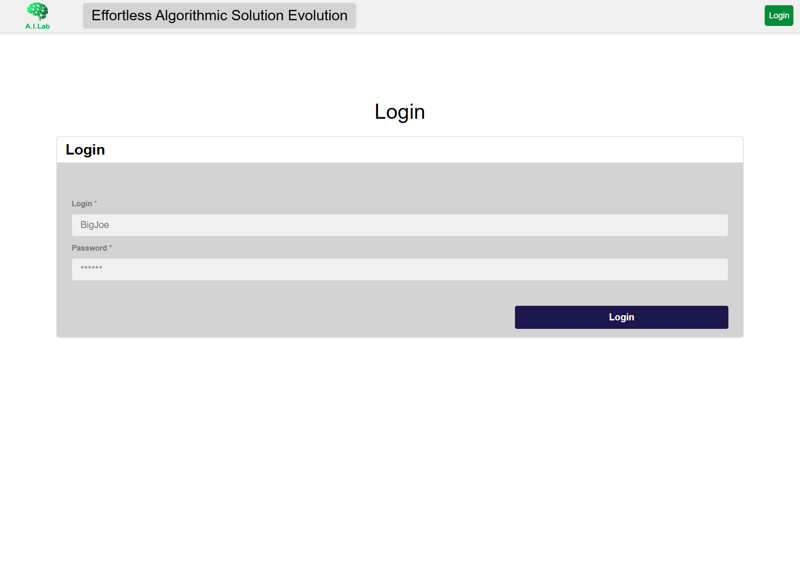
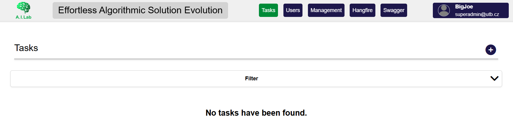
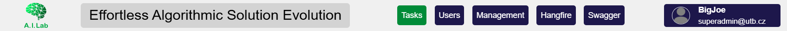
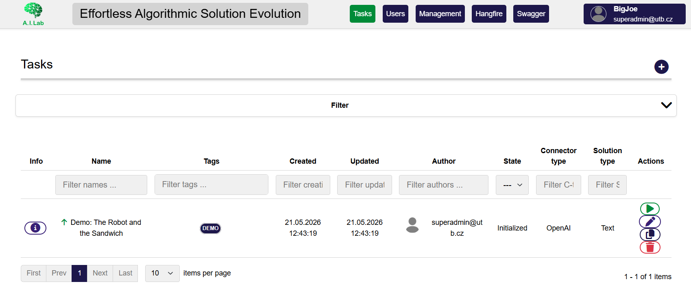
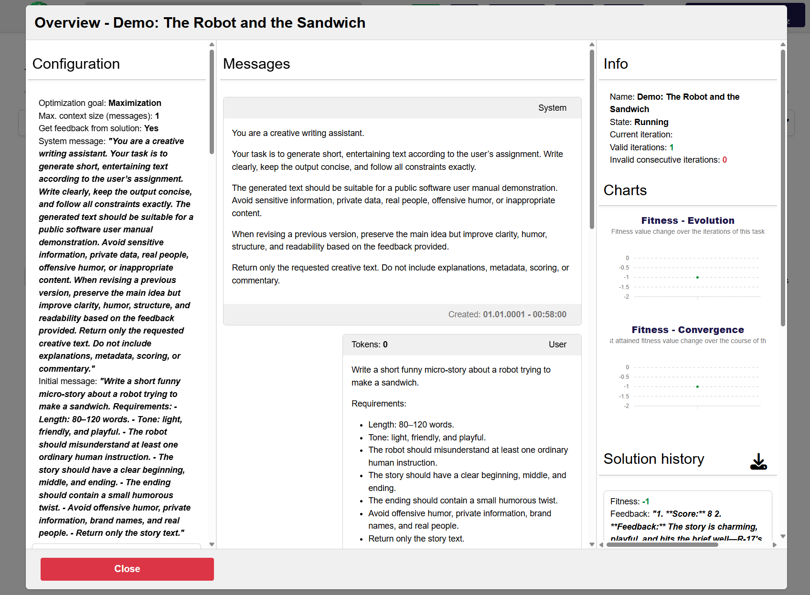

# Interface overview

This page gives a short overview of the main parts of the FrontEASE interface.

The exact layout may change between versions, but the basic workflow is usually the same: log in, create or select a task, configure its modules, start execution, and inspect the generated outputs and results.

!!! note "Screenshots"
    The screenshots in this manual are intended to illustrate the typical local/demo setup. Your interface may look slightly different depending on the current version of FrontEASE, browser size, selected configuration, and available modules.

---

## Login screen

After opening FrontEASE in the browser, the first screen is the login page.

For the seeded local setup, you can use the default demo credentials described in the installation guide.



/// caption
Login screen of the local FrontEASE instance.
///

After successful login, the application opens the main interface.

---

## Main dashboard

The main dashboard is the starting point for working with FrontEASE. It provides access to existing tasks, task creation, task details, and other available sections of the application.



/// caption
Main dashboard after logging into FrontEASE.
///

From the dashboard, users can usually:

- view existing tasks,
- create a new task,
- open task details,
- inspect the current state of a task,
- navigate to outputs, messages, solutions, and analyses.

The dashboard is mainly intended as an entry point. Most detailed work is done inside a selected task.

---

## Navigation menu

### TODO

The navigation menu provides access to the main parts of the application. Depending on the current version and user permissions, some sections may differ.



/// caption
Navigation menu with access to the main sections of FrontEASE.
///

Common navigation areas include:

- task overview,
- task detail,
- module configuration,
- generated messages,
- generated solutions,
- results and analysis outputs,
- system or user-related sections.

!!! tip
    If you are new to FrontEASE, start from the task list or dashboard and open an existing seeded example before creating your own task.

---

## Task list

The task list shows available tasks in the system. A task represents one configured experiment or execution workflow.



/// caption
Task list with available task entries.
///

A task entry usually contains information such as:

- task name or identifier,
- current task state,
- creation or update time,
- selected configuration,
- available actions.

Typical task states may include created, initialized, running, stopped, finished, or failed/interrupted states.

The task list is useful for checking which experiments already exist and whether they are still running or completed.

---

## Task overview

The task overview page shows information about a selected task. This is usually the main place for inspecting one concrete experiment.



/// caption
Task overview page showing information about a selected task.
///

Depending on the task type and configuration, the overview page may include:

- basic task information,
- current state,
- selected modules,
- generated messages,
- generated solutions,
- fitness or evaluation values,
- feedback,
- metadata,
- available result files or analysis outputs.

This view is important when checking what happened during an iterative EASE run.

---

## Module configuration

EASE tasks are configured through modules. Modules define what the task does, how solutions are generated, how they are evaluated, and when the run should stop.

In normal use, you select available modules and fill in their parameters. Details about creating or implementing new modules are in the separate section #TODO

<!---

## Messages and solutions

### TODO? Not implemented

During an EASE run, the system may create messages, generated solutions, evaluation results, feedback, and metadata. These are usually shown in a task-specific view.


/// caption
Generated messages and solutions associated with a selected task.
///

This section is useful for understanding the iterative process.

A typical sequence may contain:

1. an initial message or prompt,
2. a generated solution,
3. evaluation of the solution,
4. feedback based on the evaluation,
5. a new improved solution,
6. repeated iterations until the stopping condition is reached.

For algorithm-generation experiments, the solution is often executable code and the evaluation result is represented by a fitness value or another task-specific metric.

---

## Results and analysis

### TODO? Not implemented

After a task is completed, FrontEASE may provide result summaries, downloadable files, visualizations, or analysis outputs.


/// caption
Results or analysis view for a completed task.
///

The available outputs depend on the task configuration and enabled analysis modules.

Typical outputs may include:

- final best solution,
- fitness values,
- iteration history,
- generated files,
- plots or reports,
- task metadata,
- downloadable result packages.

!!! tip
    For longer experiments, results and analysis outputs are usually the best starting point. Use the detailed messages and solutions view when you need to inspect how the result was produced.

--->

## Typical user workflow

A common FrontEASE workflow looks like this:

```text
Log in
  ↓
Open the dashboard or task list
  ↓
Configure modules and parameters
  ↓
Create a new task or open an existing one
  ↓
Start the task
  ↓
Monitor task state
  ↓
Inspect generated messages, solutions, feedback, and metadata
  ↓
Open results and analysis outputs
```
The following pages of this manual explain these steps in more detail.

## Next step

Continue with the first practical tutorial: creating and running a simple task.