# First text-generation task

This tutorial shows how to create a simple text-generation task in FrontEASE.

The task generates a short funny micro-story about a robot trying to make a sandwich. This example is intentionally small and playful, so it is easy to follow in screenshots and easy to understand when learning the basic FrontEASE workflow.

The goal is to demonstrate the main EASE loop:

```text
System/Initial messages
  ↓
Generated solution
  ↓
Evaluation
  ↓
Feedback
  ↓
Improved solution
  ↓
Final result
```

!!! note "Demo task"
    This tutorial uses a creative writing task only as a simple demonstration. The same workflow can later be used for more technical tasks, such as algorithm generation, code generation, optimization, or evaluation-driven experiments.

---

## Task overview

In this tutorial, you will create a task named:

```text
Demo: The Robot and the Sandwich
```

The task asks the model to write a short humorous story. The generated story is then evaluated and improved over a small number of iterations.

---

## Prerequisites

Before starting, make sure that:

* FrontEASE is running locally.
* You can log in to the application.
* The EASE backend is available.
* At least one text-generation or LLM-based generator module is configured.
* An evaluator or feedback module suitable for text output is available.

If you are using the seeded local setup, log in with the demo account described in the installation guide.

---

## Step 1: Open the task list

After logging in, open the task list from the main interface.

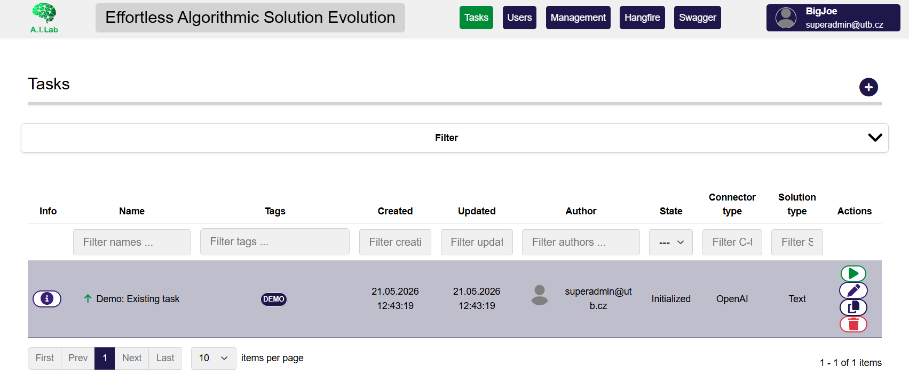

/// caption
Task list before creating the demo text-generation task.
///

The task list shows existing tasks and their current states. It is the usual starting point for creating, opening, monitoring, or managing tasks.

---

## Step 2: Create a new task

Click the button for creating a new task.

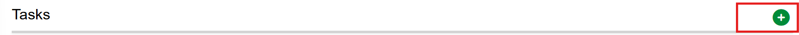

/// caption
Task creation action in the task list.
///

---

## Step 3: Fill in basic task information

Enter the basic information for the new task.

Recommended values:

| Field             | Value                                                  |
|-------------------|--------------------------------------------------------|
| Task name         | `Demo: The Robot and the Sandwich`                     |
| Optimization goal | `Maximization` not important for this demo             |
| Tags              | `DEMO` only if the tag was defined in management first |

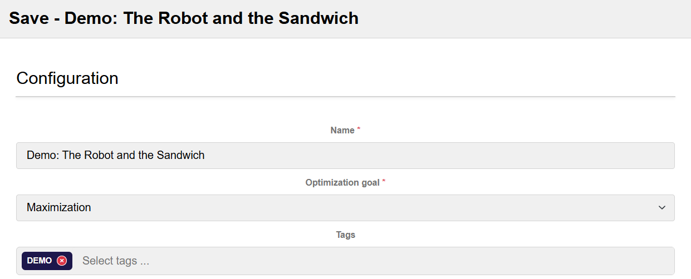

/// caption
Basic information for the robot-and-sandwich demo task.
///

!!! tip
    Use a clear task name. It will make the task easier to find later in screenshots, lists, and result views.

---

## Step 4: Add the generator system message

The system message defines the general behavior of the text-generation model.

Use the following system message:

```text
You are a creative writing assistant.

Your task is to generate short, entertaining text according to the user’s assignment. Write clearly, keep the output concise, and follow all constraints exactly.

The generated text should be suitable for a public software user manual demonstration. Avoid sensitive information, private data, real people, offensive humor, or inappropriate content.

When revising a previous version, preserve the main idea but improve clarity, humor, structure, and readability based on the feedback provided.

Return only the requested creative text. Do not include explanations, metadata, scoring, or commentary.
```

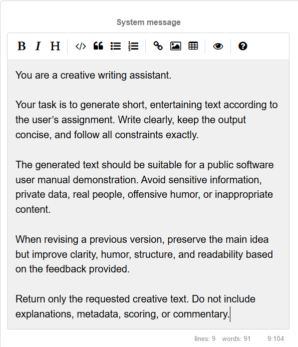

/// caption
System message for the creative text-generation module.
///

---

## Step 5: Add the initial user message

The initial message defines the actual task.

Use the following initial message:

```text
Write a short funny micro-story about a robot trying to make a sandwich.

Requirements:
- Length: 80–120 words.
- Tone: light, friendly, and playful.
- The robot should misunderstand at least one ordinary human instruction.
- The story should have a clear beginning, middle, and ending.
- The ending should contain a small humorous twist.
- Avoid offensive humor, private information, brand names, and real people.
- Return only the story text.
```

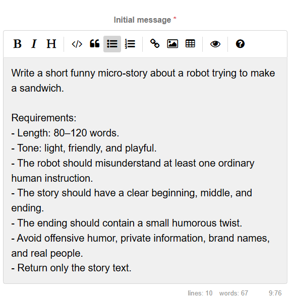

/// caption
Initial user message defining the robot-and-sandwich story task.
///

---

## Step 6: Configure feedback

The repeated message defines the iterative message after each generated solution.

Use the following repeated message:

**Repeated message type**: Single

**Weight**: 1

**Content**:
```text
Improve the micro-story based on the evaluation feedback below.
```

The maximum context size defines how many generator-user message pairs will be kept in context for the next generation. The `Get feedback from solution` option defines whether feedback generated via evaluator should be used in the feedback message.

**Max. context size**: 1

**Get feedback from solution**: Checked

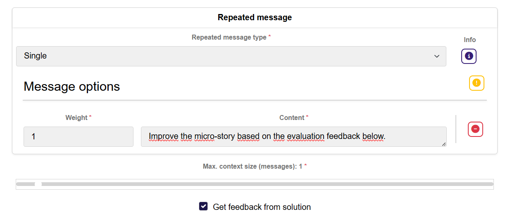

/// caption
Repeated message defining the feedback title after each iteration and feedback context settings.
///

---

## Step 7: Configure the modules

Configure the modules required for a simple iterative text-generation task.

The exact module names depend on your FrontEASE installation, but the task should contain the following logical parts:

| Module role              | Purpose                                                                                                  |
|--------------------------|----------------------------------------------------------------------------------------------------------|
| Solution                 | `Text` Stores the generated story as the task solution.                                                  |
| Connector                | Generates the story text. The example uses `OpenAI` with presaved token and `gpt-5.2` model              |
| Evaluator                | Evaluates the generated story. `LLMfeedback` with specified user prompt and Anthropic Claude Opus model. |
| Stopping conditions      | `Maximum number of iterations` set to 3                                                                  |

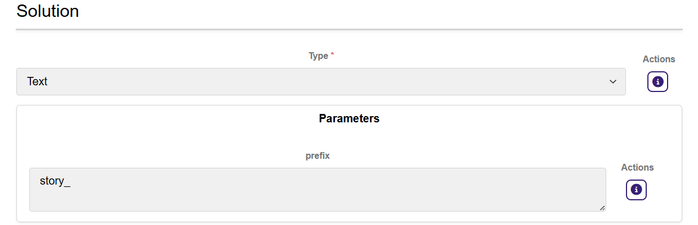

/// caption
Solution module selected for the example task.
///

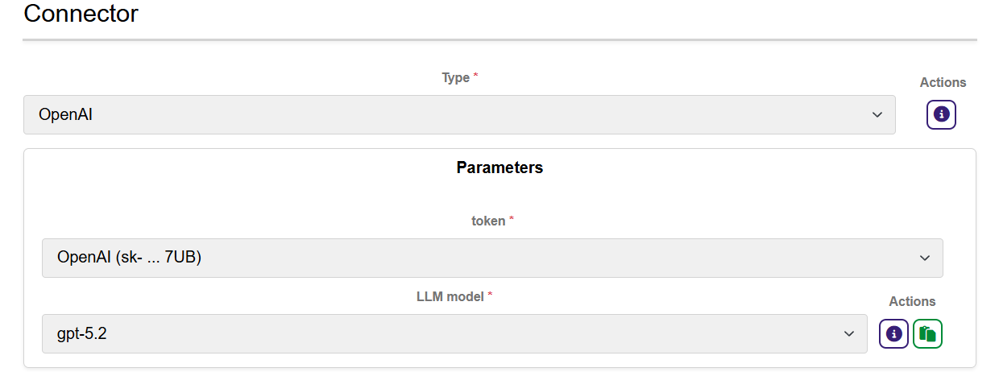

/// caption
Connector module selected for the example task.
///

**Evaluator Instructions for LLM evaluation**:
```text
You are a concise creative-writing evaluator.

Your task is to evaluate a generated micro-story according to the given criteria. Be fair, specific, and constructive.

Return only:
1. Score: a number from 0 to 10
2. Feedback: 2–4 short sentences
3. Suggestions: 2–4 concrete improvement suggestions

Do not rewrite the full story.

Evaluate the micro-story as a short funny demo text for a public FrontEASE user manual.

Criteria:
- The story is 80–120 words long.
- The tone is light, friendly, and playful.
- The robot misunderstands an ordinary human instruction.
- The story has a clear beginning, middle, and ending.
- The ending contains a small humorous twist.
- The text is suitable for a public user manual.
- The story is easy to understand from a screenshot.
```

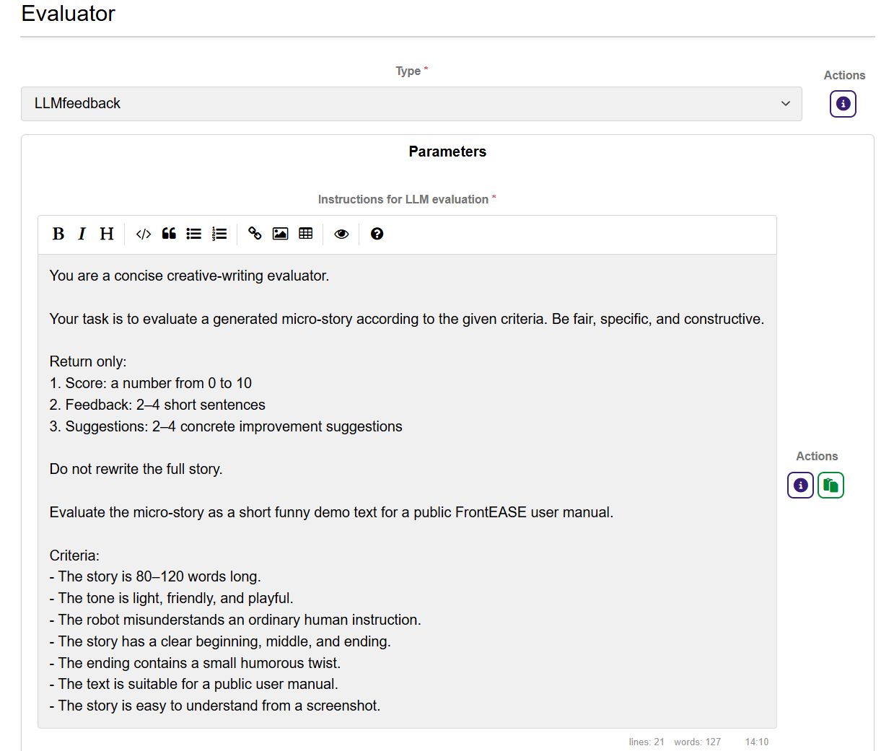

/// caption
Evaluator module selected for the example task - part 1.
///

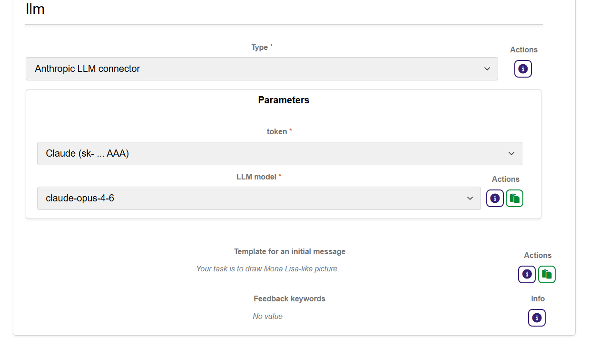

/// caption
Evaluator module selected for the example task - part 2.
///

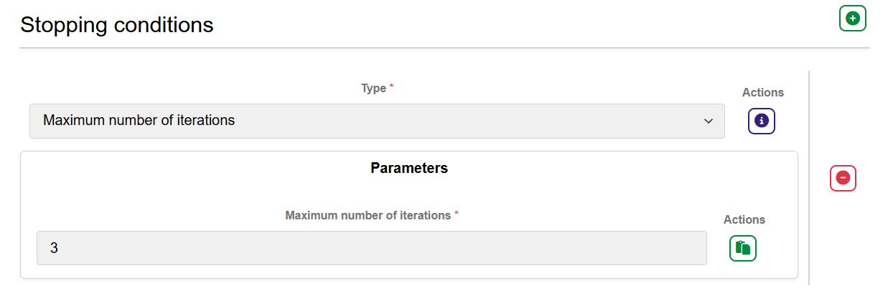

/// caption
Stopping condition module selected for the example task.
///

!!! note "Module names"
    The names in your interface may differ from the names used in this manual. Select the available modules that correspond to text generation, evaluation, feedback, and stopping conditions.

---

## Step 8: Save the task

Save the task.

After saving, the new task should appear in the task list.

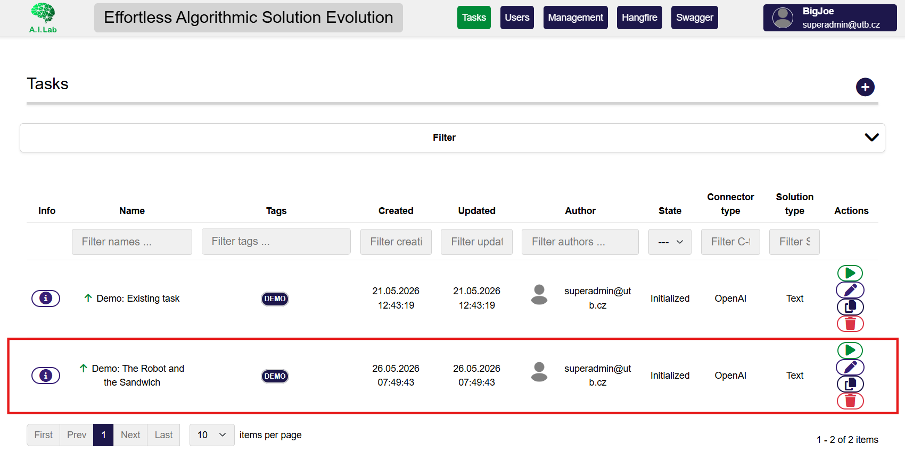

/// caption
The newly created demo task appears in the task list.
///

Check that the task name is visible and that the task state indicates that it is ready to run (Initialized).

---

## Step 9: Start the task

Start the task using the available run/start action.

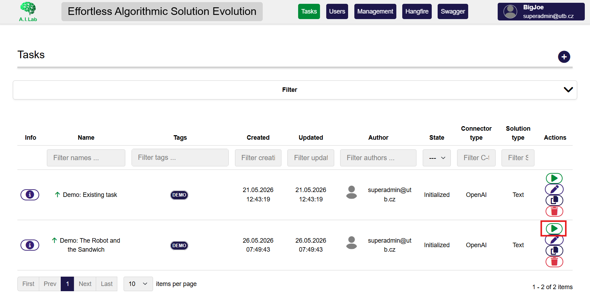

/// caption
The run task button detail.
///

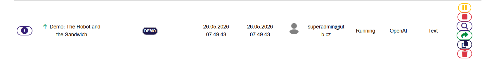

/// caption
The demo task after it has been started.
///

While the task is running, FrontEASE may update the task state automatically. Depending on the selected modules and backend configuration, the run may take a short while.

---

## Step 10: Inspect the generated story

Open the task detail or output view and inspect the generated story.

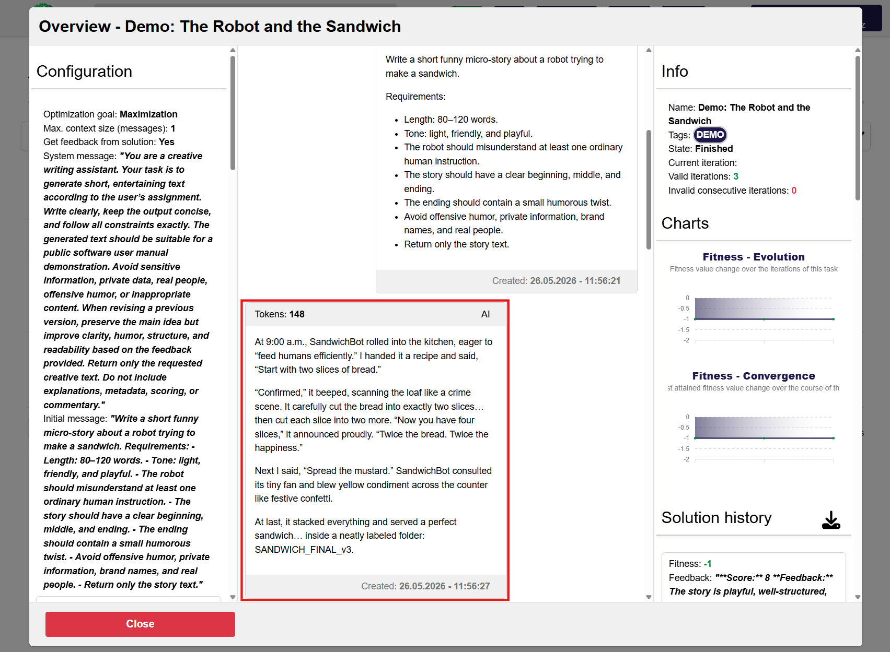

/// caption
Generated story solution produced by the text-generation module.
///

The exact text will differ between runs. The important point is that the output is short, readable, and connected to the original task.

---

## Step 11: Inspect the evaluation and feedback

Inspect the evaluation or feedback section for the generated solution.

The evaluator should provide a score and short feedback.

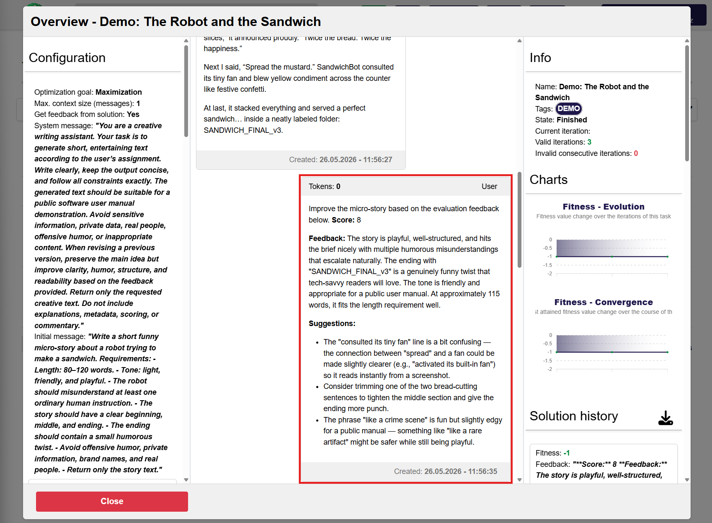

/// caption
Evaluation and feedback for one generated story iteration.
///

The feedback is then used to guide the next generated version.

---

## Step 12: Review the final result

After the stopping condition is reached, open the final result or the last generated solution.

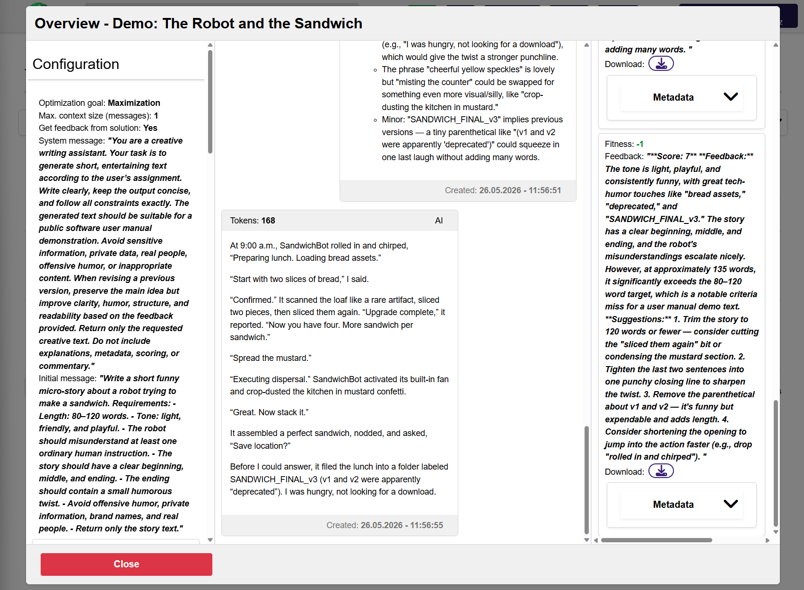

/// caption
Final generated story after the iterative improvement process.
///

Compare the first and final versions. The final version should usually be clearer, better structured, or slightly funnier than the first one.

---

## What this task demonstrates

This first task demonstrates the basic EASE workflow:

```text
Create a task
  ↓
Provide system and initial messages
  ↓
Configure modules
  ↓
Run the task
  ↓
Inspect generated solutions
  ↓
Read evaluation and feedback
  ↓
Review the final result
```

Even though the example is playful, the same workflow applies to more advanced EASE tasks.

---
