# Users and management

This page describes the user, company, and management sections of FrontEASE.

These sections are used to manage application users, organizational information, user preferences, access tokens, tags, and selected system-level settings.

!!! note "Access permissions"
    Some parts of this section are visible only to users with administrator privileges. Depending on your account role, you may not see all tabs or actions described on this page.

---

## Users and organizations

The **Users** section is available to Admins and Owners. It is intended for managing user accounts and, for Owners, organization records.

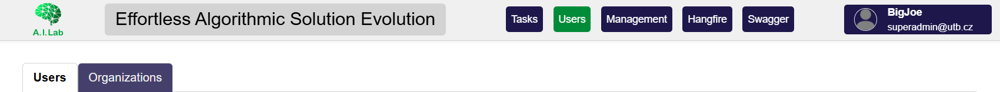

/// caption
Users page with available configuration tabs.
///

The page is divided into tabs:

- **Users** — manage FrontEASE user accounts.
- **Organizations** — manage organization records. This tab is visible only to Owners.

---

## Users tab

The **Users** tab contains a form for adding a new user and a list of existing users.

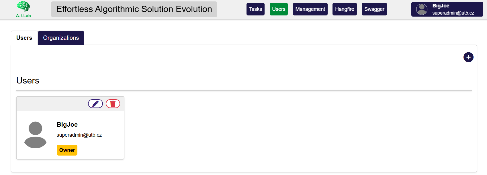

/// caption
Users tab with the user list.
///

The user list is useful for checking which accounts are available in the system and for accessing user-specific actions such as editing or deleting an account, if these actions are available to your role.

---

## Adding a user

To add a new user, open the user form using the plus icon.

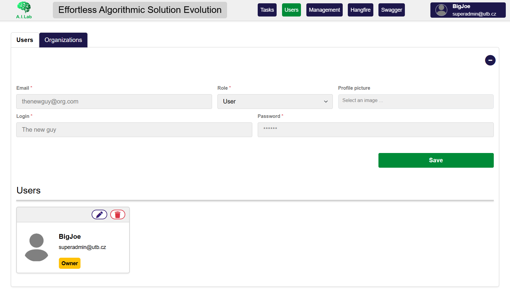

*Form for creating a new user account.*

The form contains the main user-account fields:

- **Email**
- **Role**
- **Profile image**
- **Username**
- **Password**

The exact validation rules depend on the current FrontEASE configuration.

To create the user:

1. Open the **Users** tab.
2. Click the plus icon to expand the add-user form.
3. Fill in the required fields.
4. Choose the appropriate user role.
5. Click **Save**.

After the user is saved, the new account should appear in the user list.

!!! warning "User roles"
    Be careful when assigning roles. Higher roles may allow access to administrative sections, user management, company management, or system-level settings.

---

## User roles

FrontEASE uses roles to control access to selected parts of the interface.

The current roles are:

- **User** — manages owned and shared tasks plus personal management settings;
- **Admin** — can work across users' tasks, manage users, and administer core packages and modules;
- **Owner** — has the broadest access, including organization management and Owner/Admin account management.

See [Roles, states, and actions](../reference/roles-states-actions.md) for task-state rules.

---

## Editing and deleting users

Depending on your permissions, the user list may provide actions for editing or deleting existing users.

Use editing when you need to update account details such as the username, role, email, or profile image.

Use deleting carefully. Removing a user may affect access to tasks, generated results, or records associated with that account.

!!! warning "Deleting users"
    Before deleting a user, make sure that the account is no longer needed and that important task data is not lost or made difficult to trace.

---

## Organizations tab

The **Organizations** tab is used to manage company records.

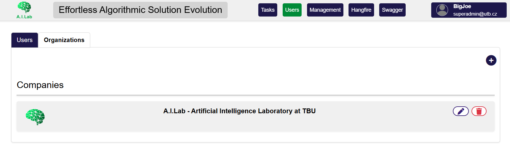

/// caption
Organizations tab with available organization records.
///

This section is available only to Owners.

An organization record can be used to group users or provide organizational information associated with the FrontEASE instance.

---

## Adding an organization

To add an organization, open the organization form using the plus icon.

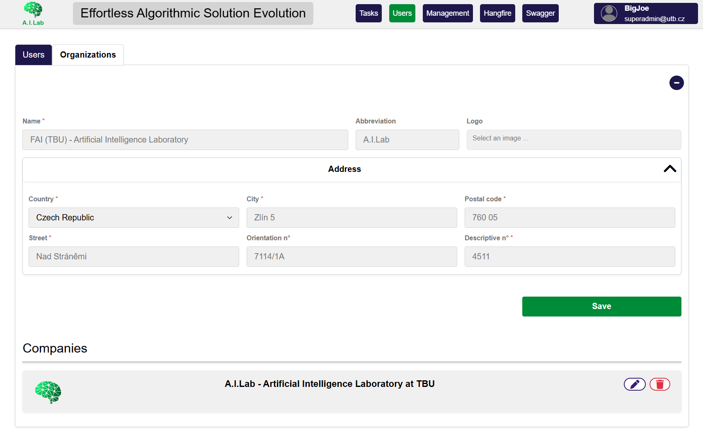

/// caption
Form for adding a new organization.
///

The organization form contains general company information and an optional address section.

Typical organization fields include:

- **Organization name**
- **Organization abbreviation**
- **Organization image or logo**

The address section may include:

- **Country**
- **City**
- **ZIP code**
- **Street**
- **Orientation number**
- additional address-related fields depending on the current configuration.

To create an organization:

1. Open the **Organizations** tab.
2. Click the plus icon to expand the add-organization form.
3. Fill in the organization details.
4. Fill in the address section if needed.
5. Click **Save**.

After saving, the organization should appear in the organization list.

---

## Management section

The **Management** section contains user-level and system-level configuration options.

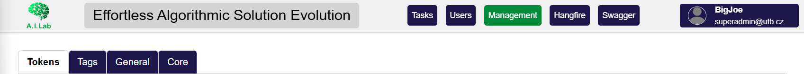

/// caption
Management page with available configuration tabs.
///

The page is organized into tabs. Depending on your role, you may see only some of them.

Common management tabs include:

- **Tokens**
- **Tags**
- **General**
- **Core**

The **Core** tab is intended for administrators or owners.

---

## Tokens

The **Tokens** tab stores named credentials for connector modules.

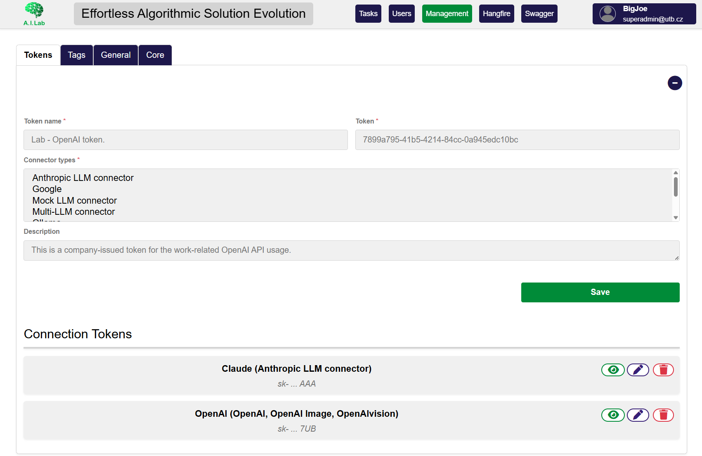

/// caption
Tokens management tab.
///

Each entry has a name, token value, one or more compatible connector types, and an optional description. Task module forms reference the saved entry instead of requiring the token to be pasted into each task.

!!! warning "Credential handling"
    Treat saved tokens as secrets. Use descriptive names that do not reveal the token value, grant only the required provider scope, and remove credentials that are no longer needed.

---

## Tags

The **Tags** tab is used to manage tags.

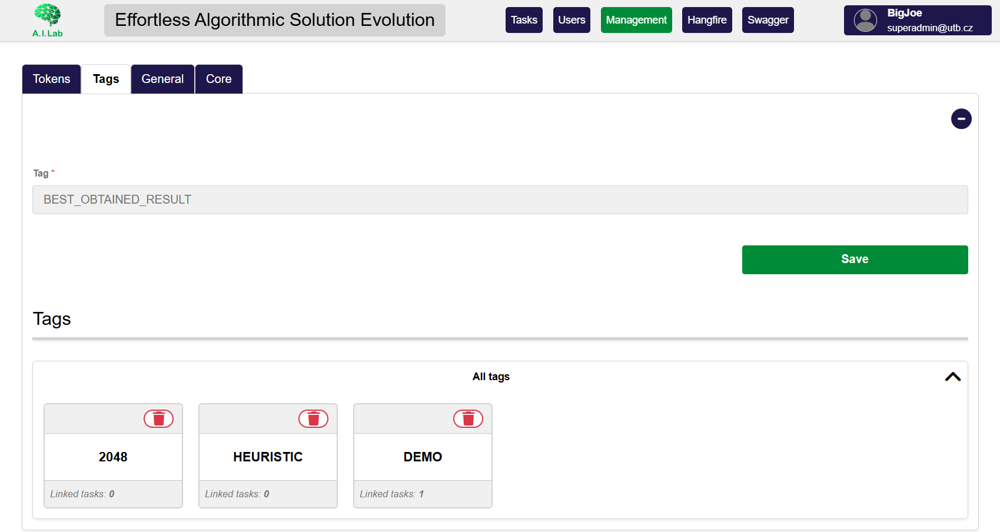

/// caption
Tags management tab.
///

Tags organize tasks and are available in task creation and grid filtering. The page distinguishes the signed-in user's tags from the combined tags available to the instance.

---

## General settings

The **General** tab contains general user or application preferences.

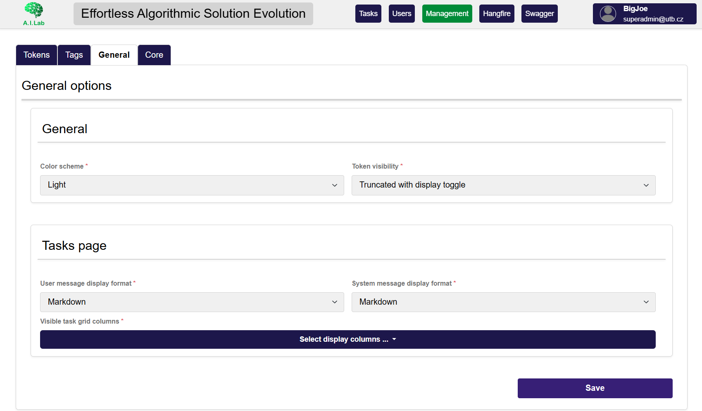

/// caption
General settings tab.
///

Use this section to choose:

- light or dark color scheme;
- saved-token visibility behavior;
- System and User message display formats;
- which task-grid columns are visible.

---

## Core settings

The **Core** tab contains system-level settings and is available to Admins and Owners.

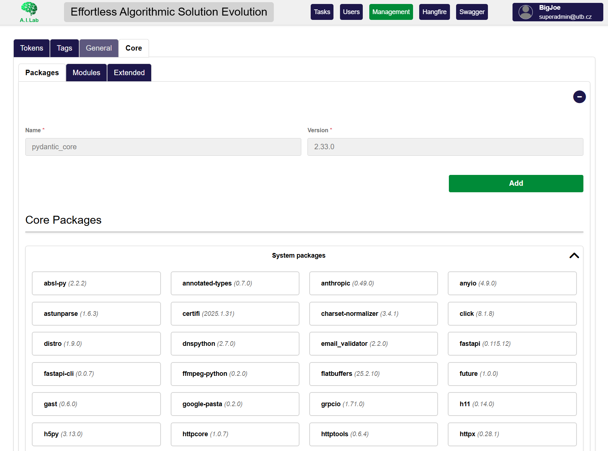

/// caption
Core Packages tab.
///

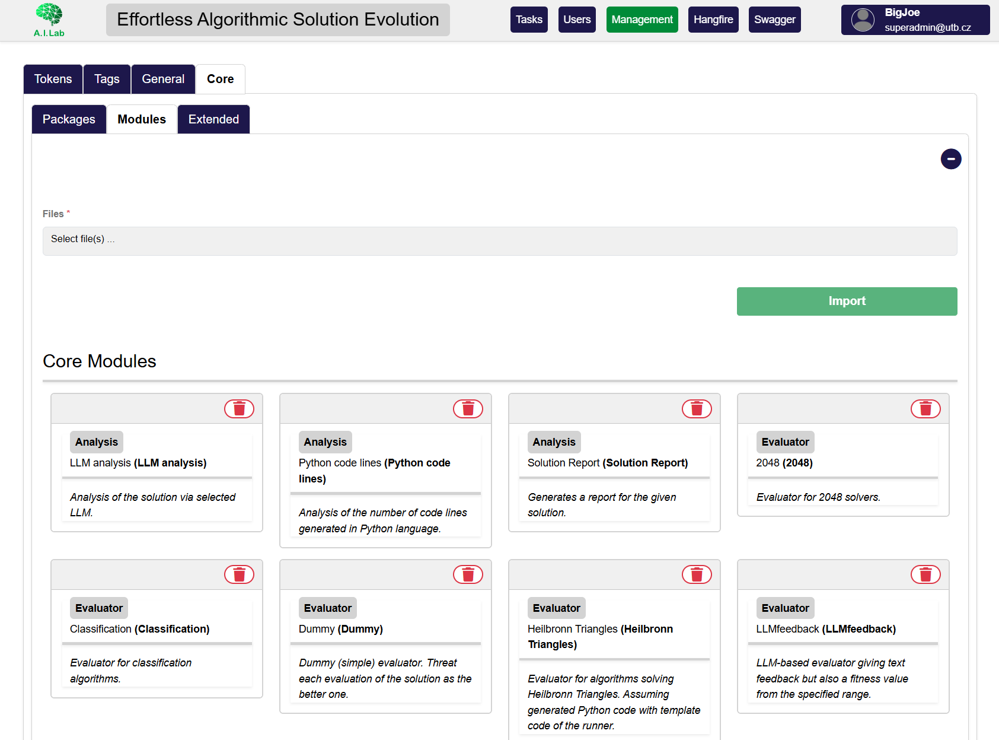

/// caption
Core Modules tab.
///

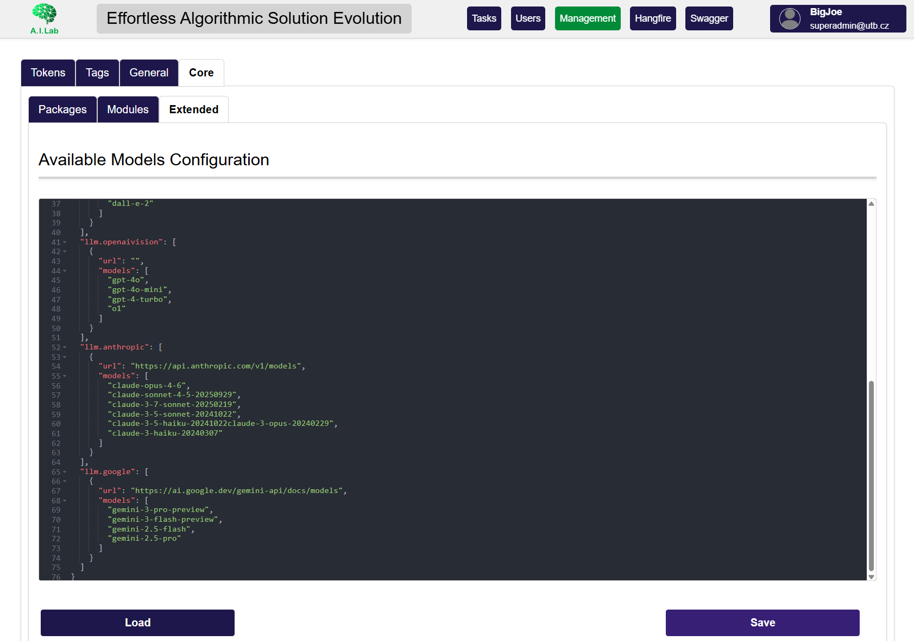

/// caption
Core Packages tab.
///

The nested tabs are:

- **Packages** — review or install Python package requirements by name and version;
- **Modules** — review discovered modules, import `.py` or `.zip` module files, and remove modules;
- **Extended** — inspect available connector models and update model configuration.

Only change core settings if you understand their effect on the running FrontEASE instance.

!!! danger "Core settings"
    Incorrect core settings may affect application behavior. In a shared or production-like setup, coordinate changes with the person responsible for maintaining the FrontEASE instance.

---

## Typical administrator workflow

A typical administrator workflow looks like this:

```text
Log in as an administrator
  ↓
Open Users and organizations
  ↓
Create or update users
  ↓
Assign appropriate roles
  ↓
Create or update organization records if needed
  ↓
Open Management
  ↓
Configure tokens, tags, general settings, or core settings
```

For normal experiment work, most users will spend more time in task-related pages. The users and management sections are mainly used when preparing or maintaining the FrontEASE instance.

## Next step

Create the [first task](first-text-task.md), or return to the broader [task-management guide](task-management.md).
